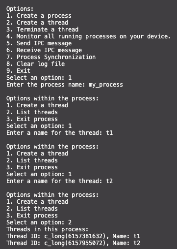
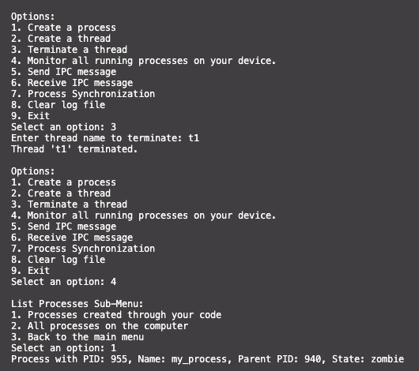
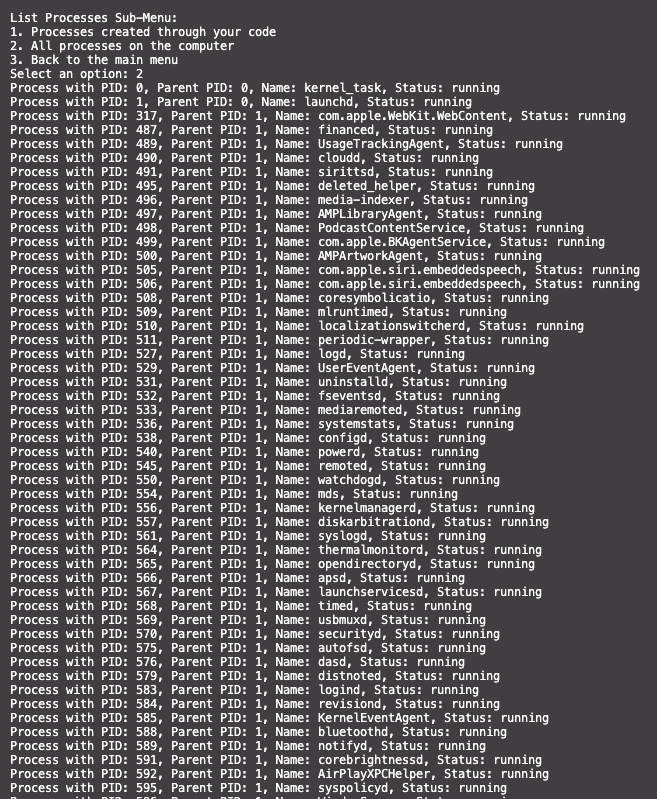
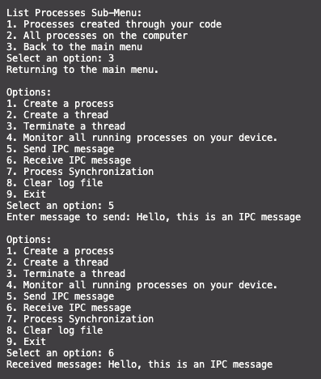
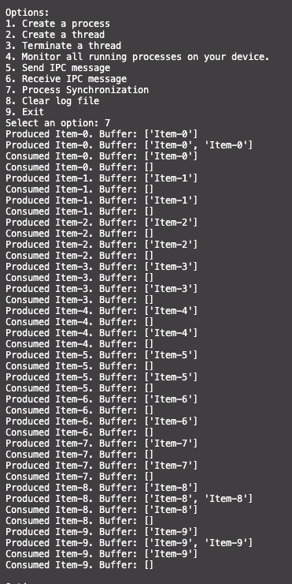

# Advanced Process Manager with Process Synchronization

## Table of Contents
1. [Implemented Functionalities](#implemented-functionalities)
2. [Installation](#installation)
3. [Function Explanations / Design](#function-explanations--design)
4. [Results & Explanation](#results--explanation)
5. [Demonstration](#cli-demonstration)
6. [Discussion & Conclusion](#discussion--conclusion)

# 
## Implemented Functionalities

- **Process and Thread Management:** This program allows you to create and manage processes and threads. You can create new threads with custom names and terminate them when needed.

- **Process Listing:** The tool provides the capability to list running processes and displays details about each process, such as the process ID, parent process ID, and its current state.

- **Inter-Process Communication (IPC):** It enables communication between processes through IPC. You can send and receive messages between processes using pipes.

- **Process Synchronization:** The tool demonstrates process synchronization using a mutex. It showcases how to use a mutex to synchronize access to shared resources and ensure that multiple processes or threads can safely access critical sections of code.

- **Producer-Consumer Problem:** The program addresses the classic producer-consumer problem using semaphores. It creates a shared buffer, and multiple producer and consumer threads interact with the buffer, ensuring that producers don't produce when the buffer is full and consumers don't consume when it's empty.

# 
## Installation

To set up and run the Advanced Process Manager on your local machine, follow these steps:

1. **Clone the Repository**: Use the following Git command to clone the repository to your local machine:
   ```shell
   gh repo clone Deep4GB/CMPSC472_Project1

2. Install Dependencies: Install the required dependencies using the following command:
    ```shell
    pip install psutil

3. Run the Process Manager: Execute the following command to run the Process Manager:
    ```
    python3 main.py

# 
## Function Explanations / Design

### `process_function(process_name)`
- This function is executed within child processes.
- It logs the running state of a child process and allows you to create threads, list threads, and exit the process.

### `create_process(process_name)`
- Creates a new process with the given name.
- Uses `os.fork()` to fork a child process and `os.execlp()` to run the specified program.
- Manages the list of running processes and logs their creation.

### `list_processes()`
- Displays a menu to list running processes.
- Provides options to list processes created through your code and all processes on the computer.
- Retrieves process details, such as PID, parent PID, name, and status, using the `psutil` library.

### `create_thread(thread_name)`
- Creates a new thread within the current process.
- Uses the `ctypes` library to create a thread and logs the successful creation.

### `terminate_thread(thread_name)`
- Terminates a thread with the specified name.
- Sets an exit signal to indicate the thread should exit.
- Uses `ctypes` to call `pthread_join` to terminate the thread.

### `list_threads()`
- Lists threads within the current process.
- Retrieves thread IDs and names for display.

### `ipc_send(message)`
- Sends an Inter-Process Communication (IPC) message through a pipe.
- Encodes and writes the message to the pipe for communication.

### `ipc_receive()`
- Receives an IPC message from a pipe.
- Checks for available data in the pipe, reads and decodes the message, and logs it.

### `producer()`
- Represents the producer function for a producer-consumer example.
- Produces items, acquires semaphores for empty slots and mutex for buffer access, and adds items to the buffer.
- Logs the produced items and simulates work with random delays.

### `consumer()`
- Represents the consumer function for a producer-consumer example.
- Consumes items from the buffer, acquires semaphores for filled slots and mutex for buffer access.
- Logs the consumed items and simulates work with random delays.

### `process_synchronization()`
- Demonstrates process synchronization for the producer-consumer example.
- Creates producer and consumer threads and manages their execution.
- Ensures synchronization using semaphores for empty and filled slots.

### `clear_log()`
- Clears the log file named 'Advanced_Process_Manager.log'.
- Opens the file and truncates its content, effectively clearing the log.

### Main Entry Point
- Executes when the script is run.
- Displays a menu to interact with different functionalities, including creating processes, threads, terminating threads, monitoring processes, IPC messaging, process synchronization, clearing log files, and exiting the program.

# 
## Results & Explanation

The advanced process manager, enhanced with synchronization mechanisms, offers an efficient solution for the management and monitoring of processes and threads. It plays a crucial role in ensuring synchronization to prevent data corruption and conflicts over shared resources. This tool serves as an invaluable resource for comprehending and implementing synchronization mechanisms, particularly in scenarios involving common challenges like producer-consumer and reader-writer problems.

# 
## CLI Demonstration

#### The following images provide a visual representation of the Command-Line Interface (CLI) in action, showcasing each option's functionality and appearance. While the CLI output offers concise information for better readability, a comprehensive log of these actions is recorded in the "Advanced_Process_Manager.log" file, allowing for more detailed examination of the commands and their outcomes.







#### These images and the corresponding log file together offer insights into how the CLI commands are executed and provide detailed records of the program's activities for reference and analysis.

#
## Discussion & Conclusion

The program showcases how synchronization mechanisms like semaphores and mutexes can be applied to solve common synchronization problems encountered in multi-process and multi-threaded applications. It offers a practical understanding of how to protect shared resources and coordinate the execution of multiple processes and threads.

In conclusion, this advanced process manager with process synchronization is a valuable tool for both learning and practical implementation. It equips users with the knowledge and tools needed to manage processes and threads effectively, ensuring secure data access and minimizing conflicts. It's a valuable addition to any developer's toolkit when working with concurrent and parallel processing.
